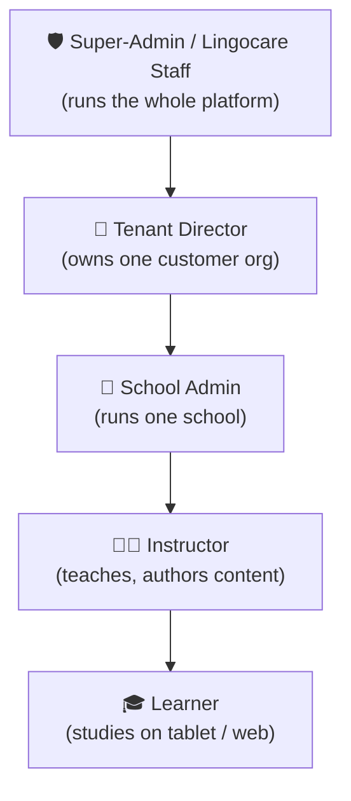
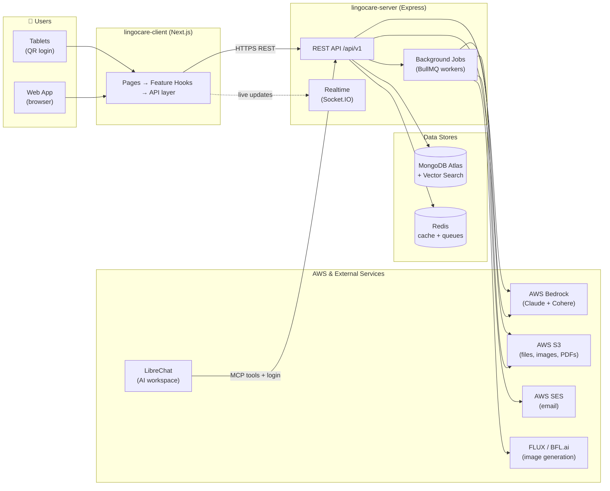
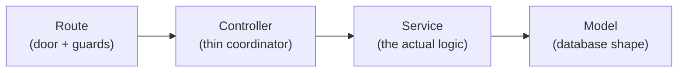
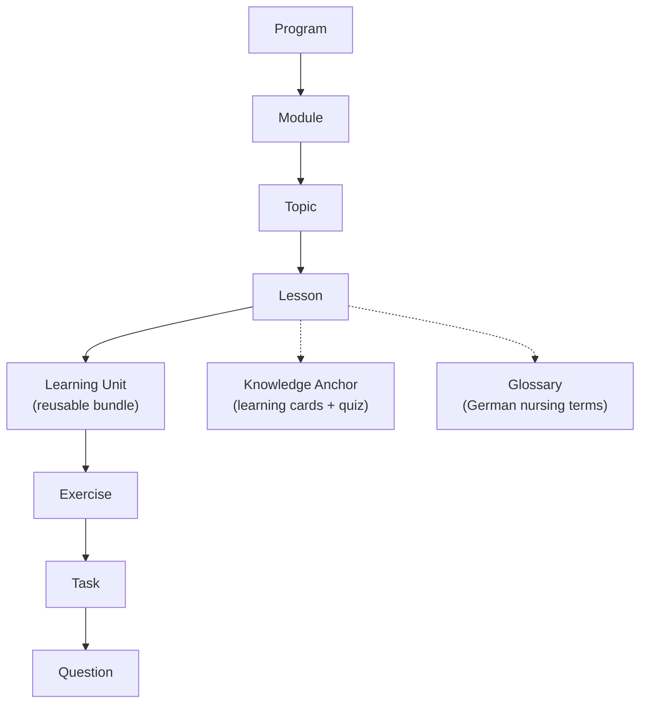
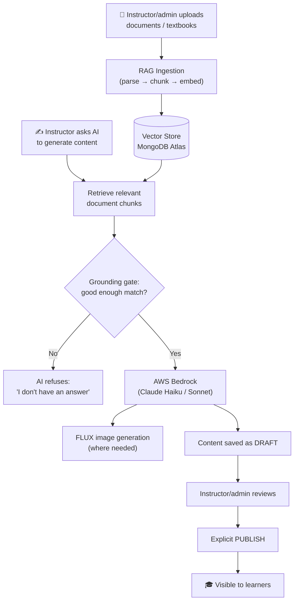
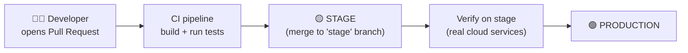
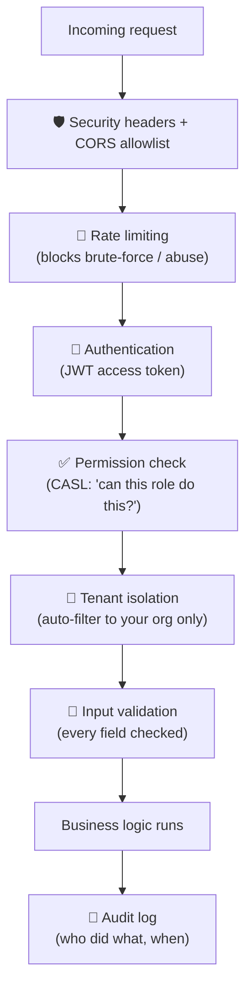
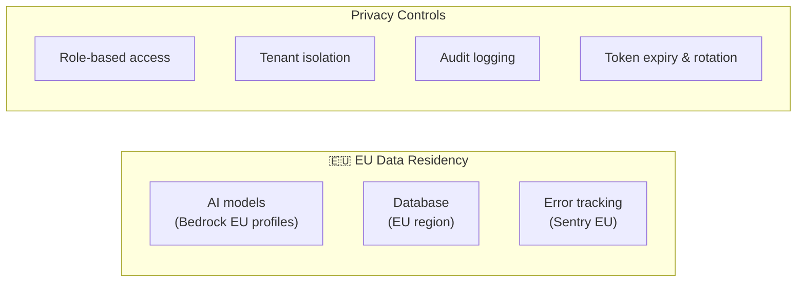

# Lingocare — Application Bible

> **The single source of truth for the Lingocare platform.**
> Written for product owners, founders, and non‑technical stakeholders. No code — just what the
> system is, how its pieces fit together, how it ships, and how it stays safe and compliant.

- **Owner:** Product / Engineering
- **Last updated:** 2026‑06‑22
- **Scope:** `lingocare-server` (backend) + `lingocare-client` (web app)

---

## 1. What Lingocare Is

Lingocare is a **multi‑tenant, AI‑assisted learning platform for vocational German in the care /
nursing sector**. It helps nursing schools teach the German language and clinical communication that
international care workers need on the job.

Three things make it distinctive:

| # | Pillar | What it means in plain language |
|---|--------|---------------------------------|
| 1 | **AI‑first content authoring** | Instructors generate full curricula, exercises, and learning cards with AI — grounded in their own documents — instead of writing everything by hand. |
| 2 | **Three proficiency levels (L1/L2/L3)** | The same exercise is delivered in three difficulty levels of German, so learners of different abilities work side by side. |
| 3 | **Hard multi‑tenant isolation** | Every customer organisation (a "tenant") has its own private world of users, schools, curricula and content. No data ever crosses between tenants. |

It also tracks **AI usage with a credit wallet** (every AI action has a measured cost) and keeps an
**immutable audit trail** of who did what.

### Who uses it

---

## 2. Tech Stack at a Glance

| Layer | Backend (`lingocare-server`) | Frontend (`lingocare-client`) |
|-------|------------------------------|-------------------------------|
| **Language** | TypeScript (Node.js 20) | TypeScript (strict) |
| **Framework** | Express 4 | Next.js 16 (React 19, App Router) |
| **Data** | MongoDB Atlas (Mongoose 9) | — (thin client; server is source of truth) |
| **Cache / Jobs** | Redis + BullMQ job queues | — |
| **Server state** | — | TanStack Query |
| **UI state** | — | Redux Toolkit |
| **UI kit** | — | Material‑UI (MUI 7) + D3 charts |
| **AI** | AWS Bedrock (Claude) + Cohere embeddings | Streaming chat surfaces |
| **Auth** | JWT + CASL permissions | Axios with auth/impersonation headers |
| **Errors** | Sentry + Winston logs | Sentry |
| **Testing** | Jest (1,510 tests) | Vitest + Playwright (152 tests) |

---

## 3. The Big Picture — How It All Connects

**In words:** the browser/tablet talks only to the backend's REST API. The backend stores everything
in MongoDB, uses Redis for caching and background work, and reaches out to AWS Bedrock for AI, S3 for
files, and SES for email. Heavy AI work (generating a whole curriculum, embedding documents) runs as
**background jobs** so the user interface never freezes. Live progress (a class dashboard, an AI job
finishing) is pushed back to the screen over a realtime channel.

---

## 4. How the Backend Is Organised

The backend is a set of ~43 **feature modules**, each one following the same simple recipe:

> **Golden rule:** controllers never touch the database directly — all data goes through a service.
> Every change request is validated and permission‑checked at the door.

### Module map (what the system can do)

| Domain | Modules | What it covers |
|--------|---------|----------------|
| **Identity & Access** | auth, device‑auth, session, user, role, invitation, people, lead | Login, QR tablet login, sessions, users, roles, invitations |
| **Organisation** | tenant, school | Customer orgs and the schools inside them |
| **Curriculum & Content** | program, module, topic, lesson, material, question, exercise, knowledge‑anchor, glossary, tag‑dimension, question‑type | The full teaching content hierarchy + AI‑authored content |
| **Learning Delivery** | learning‑unit, learning‑unit‑attempt, collaborative | Reusable exercise bundles, student attempts, paired editing |
| **Scheduling & Enrolment** | term, term‑schedule, term‑group, enrollment, class‑event | Cohorts, timetables, calendar events, student enrolment |
| **AI & Integrations** | ai‑chat, ai‑wallet, content‑ai, rag, mcp, translation | AI tutoring, credit metering, AI generation, document grounding, AI tools |
| **Operations** | admin, audit, notification, feedback, demo, upload, analytics | Dashboards, audit log, notifications, file uploads, sales demos |

### The content hierarchy

---

## 5. The AI Ecosystem

Key facts a product owner should know:

- **Two AI brains, picked automatically.** A "model router" sends simple requests to the faster,
  cheaper **Claude Haiku** and complex ones to the smarter **Claude Sonnet** (~80/20 split).
- **Grounded, not made up.** Answers must clear a similarity threshold against real source documents.
  If nothing relevant is found, the AI **refuses** rather than hallucinate — important for clinical safety.
- **Everything AI‑authored starts as a draft** and only becomes visible to learners after a human
  explicitly publishes it.
- **Cost is metered.** Every AI call records token counts and converts to credits against a wallet.
- **EU‑based AI.** The Claude and Cohere models run on EU inference profiles (data residency).

---

## 6. The External Ecosystem (What Lingocare Depends On)

| Service | What it's used for | Why it matters |
|---------|--------------------|----------------|
| **AWS Bedrock** | Claude (Haiku & Sonnet) for generation; Cohere for embeddings | The AI engine. EU region for compliance. |
| **MongoDB Atlas** | Main database **and** vector search for AI grounding | Stores all data; powers "find relevant document" search. |
| **Redis** | Cache (permissions) + background job queues | Keeps the app fast and handles heavy work in the background. |
| **AWS S3** | Stores uploaded files, optimised images, generated images, PDFs | The file cabinet. Served securely via signed links. |
| **AWS SES** | Sends transactional email (invites, verification, resets) | How users get invited and verified. |
| **CloudFront** | CDN + signed URLs for files/images | Fast, secure file delivery. |
| **FLUX (BFL.ai)** | Generates illustrative images for learning content | Visual content for exercises and cards. |
| **AWS Translate** | Helper translation during authoring | Supports German/English content work. |
| **LibreChat** | Embedded AI workspace (logs in via Lingocare, uses its tools) | Power‑user AI authoring surface. |
| **HubSpot** | Sales / demo‑booking pipeline | Connects marketing leads to the platform. |
| **Sentry** | Error tracking on both client and server | Tells engineering when something breaks. |

---

## 7. Deployment Strategy — From Stage to Production

**How shipping works:**

1. **Containerised.** Both the server and client are packaged as Docker images (Node 20). The server
   can also run as an **AWS Lambda** function; the client builds as a standalone Next.js app.
2. **CI/CD gate.** Code merged into the `stage` branch triggers an automated pipeline: build →
   run tests → build Docker image → push to AWS (ECR) → update the running service.
3. **Stage first, then prod.** Changes are proven on a **staging environment** (which talks to real
   cloud services in a separate space) before being promoted to **production**.
4. **Two environments, same recipe.** Stage and prod use the same Docker build; only configuration
   (secrets, database connection, API URLs) differs — set via environment variables, never in code.
5. **Health‑checked & graceful.** The server exposes a health endpoint and shuts down cleanly
   (finishing in‑flight work) when redeployed.

| Environment | Purpose | Audience |
|-------------|---------|----------|
| **Local** | Developer machines | Engineers |
| **Stage** | Pre‑release verification against real services | Internal team, pilots |
| **Production** | Live customers | Schools, instructors, learners |

---

## 8. Security — How Lingocare Stays Safe

| Control | What it does |
|---------|--------------|
| **Login security** | Passwords hashed (bcrypt); account locks after repeated failures; rotating refresh tokens with replay detection. |
| **Role‑based access (RBAC)** | 7 roles from super‑admin to learner; every action checks an explicit permission like `content.create`. |
| **Tenant isolation** | A central database layer automatically scopes every query to the user's organisation. **Fails closed** — if context is missing, nothing is returned (no leaks). |
| **Rate limiting** | Layered limits protect login, password/email actions, and the whole API from abuse. |
| **Input/output safety** | Every request is validated; rich‑text is sanitised; error messages never leak internal details. |
| **Secrets** | Kept out of source code, injected via environment, never committed to git. |
| **Encryption in transit** | HTTPS/TLS everywhere; secure (HTTP‑only) cookies for refresh tokens. |
| **Audit trail** | An immutable log records sensitive actions with actor, IP, and timestamp. |
| **AI safety guardrails** | Clinical‑safety rules, a distress detector, crisis resources, and a prohibited‑term filter govern AI output. |

---

## 9. GDPR & Compliance Posture

**In place today**

- ✅ **EU data residency** — AI inference, primary database, and error tracking run in the EU.
- ✅ **Strict access control** — RBAC plus per‑org isolation limits who can see personal data.
- ✅ **Audit logging** — sensitive actions are recorded immutably.
- ✅ **Minimised exposure** — short‑lived access tokens, rotating refresh tokens, session limits.
- ✅ **Clinical privacy rules** in AI generation (e.g. preserve patient privacy in scenarios).

**Known gaps / roadmap (be transparent with stakeholders)**

- ⚠️ **No formal data‑retention policy yet** — how long audit logs, sessions, and inactive accounts
  are kept is not documented.
- ⚠️ **No self‑service GDPR endpoints** — Subject Access Requests and "right to be forgotten"
  (export/delete) are handled manually, not via built‑in tooling.
- ⚠️ **Admin impersonation isn't separately audited** — super‑admins can act as another role, but it
  doesn't yet emit its own audit event.
- ⚠️ **Multi‑factor authentication (MFA)** is not implemented.

> These are tracked engineering items, not blockers for the current product, but they should be on the
> compliance roadmap before broad enterprise rollout.

---

## 10. One‑Page Summary

| Question | Answer |
|----------|--------|
| **What is it?** | A multi‑tenant, AI‑assisted German‑for‑care learning platform for nursing schools. |
| **Who uses it?** | Lingocare staff, tenant directors, school admins, instructors, and learners. |
| **How is it built?** | Next.js web app → Express REST API → MongoDB + Redis → AWS Bedrock/S3/SES. |
| **What's the AI?** | Claude (via AWS Bedrock) grounded in customer documents (RAG); refuses when unsure. |
| **How does content flow?** | AI generates a **draft** → human reviews → explicit **publish** → visible to learners. |
| **How does it ship?** | Docker images, automated CI/CD, **stage → production** promotion. |
| **Is it secure?** | JWT auth + role permissions + automatic tenant isolation + audit logging + rate limits. |
| **Is it GDPR‑ready?** | EU data residency + strong access control today; retention policy & SAR tooling on the roadmap. |
| **How healthy is the code?** | Both apps type‑check cleanly; ~98% of automated tests pass (see the Status doc). |

---

*This document is the canonical product‑level overview. The deep technical references live in
`lingocare-server/docs/spec/Lingocare_Server_Specification.md` and
`lingocare-client/docs/ARCHITECTURE.md`. The companion document, `APPLICATION_STATUS.md`, tracks what
is built and working today.*
